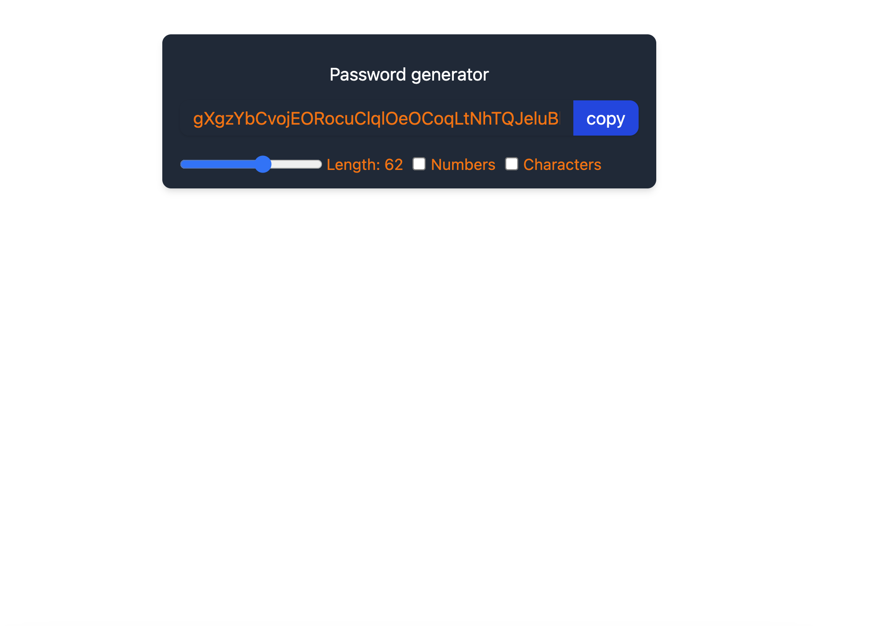

# Password Generator

A simple and customizable password generator built with React. This application allows users to generate strong passwords with adjustable length, numeric characters, and special characters.

## Demo

 

## Features

- Generate random secure passwords
- Adjustable password length (6 to 100 characters)
- Option to include:
  - Numbers (e.g. `123456`)
  - Special characters (e.g. `!@#$%^&*`)
- One-click copy to clipboard
- Responsive and minimal UI using TailwindCSS

---

## Tech Stack

- **React** (with hooks)
- **Tailwind CSS** for styling

---

## Installation

1. Clone the repository:

```bash
git clone https://github.com/sunil-1-dev/password-generator.git
